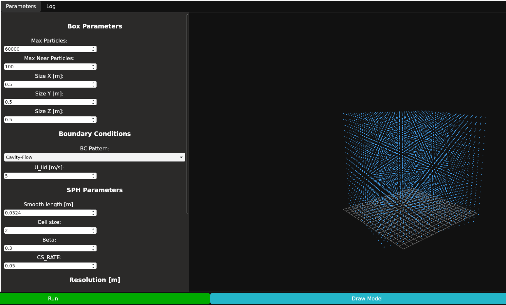

# sph_fluid_3d

3D Fluid Simulation with SPH

## Contents

- [sph_fluid_3d](#sph_fluid_3d)
  - [Contents](#contents)
  - [Quick Start](#quick-start)
  - [Dependencies](#dependencies)
  - [Model Examples](#model-examples)
  - [Used version](#used-version)
  - [License](#license)

## Quick Start

- Linux

```shell
make ui
```

- Windows

```PowerShell
cd gui && npm run tauri build --no-bundle
```

## Dependencies

[Cargo.toml](./Cargo.toml)

## Model Examples

- [ ] Box Model
  - [x] Generate base model and sim
  - [ ] Cavity-Flow <- Current Working
      
  <!-- - [ ] NACA2412 Wing <- Now Working
         -->

## Used version

- rustc 1.91.0
- rustup 1.28.2

## License

- MIT license
