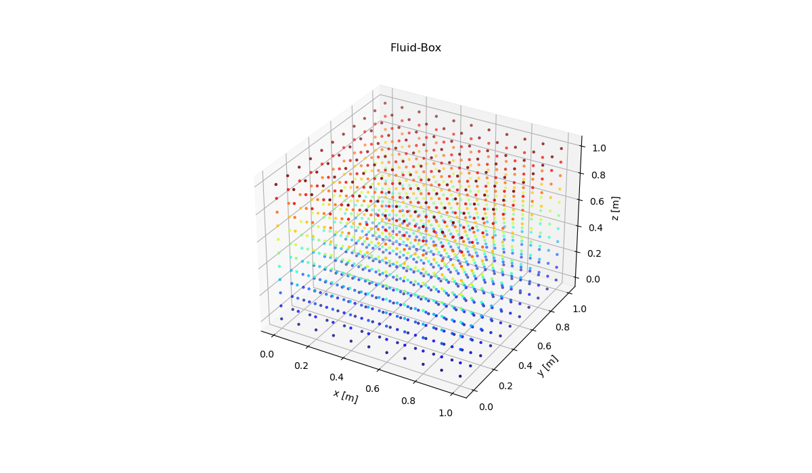

# sph_fluid_3d

3D Fluid Simulation with SPH

## Contents

- [sph\_fluid\_3d](#sph_fluid_3d)
  - [Contents](#contents)
  - [Quick Start](#quick-start)
  - [Dependencies](#dependencies)
  - [Model Examples](#model-examples)
  - [Used version](#used-version)
  - [License](#license)

## Quick Start

- Linux

```shell
make release
```

- Windows

```PowerShell
cargo run
```

## Dependencies

[Cargo.toml](./Cargo.toml)

## Model Examples

- [x] Box Model
      
- [ ] NACA2412 Wing <- Now Working
      

## Used version

- rustc 1.85.0
- rustup 1.27.1

## License

- MIT license
